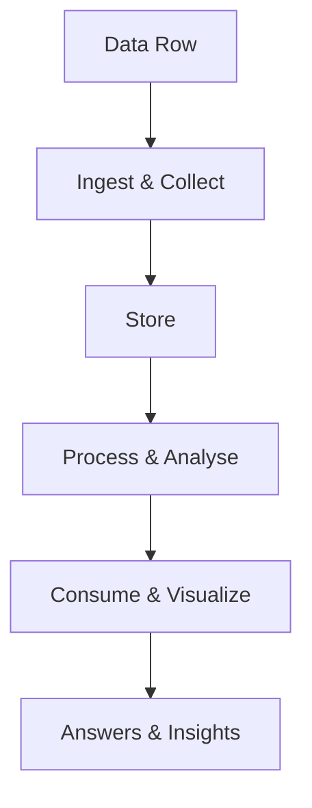
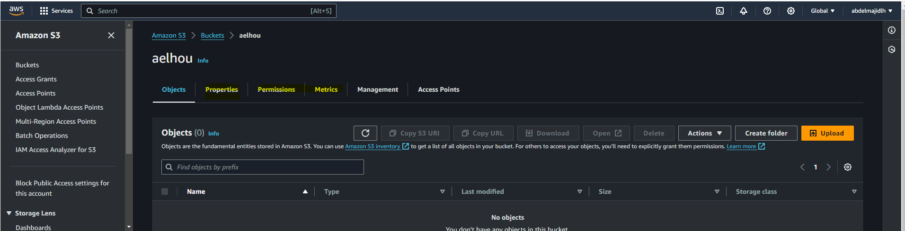

## Préparation AWS Certified Data Engineer - Associate (DEA-C01) :

### Section 1 : Introduction
#### 1. Contenu de l'examen
Examine la capacité à implémenter les data pipelines, les surveiller, les déboguer et optimiser leurs performances et coûts en suivant les bonnes pratiques. Pour réussir l'examen, il faut avoir un score minimum de 720 (sur 1000).

L'examen dure environ 170 minutes et comprend 85 questions à choix multiples ou de sélection de la bonne réponse.

Cet examen couvre 4 domaines :
- Domaine 1 : Data ingestion and Transformation (34% du score)
- Domaine 2 : Data store management (26%)
- Domaine 3 : Data operations and support (22%)
- Domaine 4 : Data security and governance (18%)


#### 2. Activités quotidiennes d'un ingénieur data AWS

- La première responsabilité d'un ingénieur de données AWS est d'utiliser les services AWS pour extraire des insights à partir des données de manière efficace et sécurisée.
- Concevoir et implémenter l'ingestion des données ainsi que des solutions de stockage : Amazon S3, AWS Glue, Amazon Redshift.
- Traitement et transformation des données : développer des pipelines pour convertir les données brutes en données prêtes pour l'analyse ou d'autres besoins : services tels que AWS Glue, AWS Lambda et Amazon EMR.
- Visualisation des données : utiliser Athena, Amazon QuickSight ou Redshift Spectrum pour créer des graphiques.
- Mise en place de mesures de sécurité pour protéger la confidentialité des données et assurer leur intégrité.
- Optimisation des performances et surveillance des workflows.


#### 3. Le challenge en big data
Les données arrivent de différentes sources (réseaux sociaux, emails, bases de données, images, logs, bases de données publiques, ... etc.). Le problème / challenge est d'exploiter ces données massives (stockage et analyse).

Les 5 V du Big Data :
- `Volume` : combien de données ?
- `Variété` : quel type de données ? Structurées, semi-structurées ou bien non-structurées !
- `Velocity` : quelle fréquence / temps réel ? En gros, c'est la vitesse à laquelle les données doivent être traitées.
- `Veracité` : Quelle précision des données ? C'est la confiance dans vos données.
- `Valeur` : c'est le résultat des 4 V.

Une solution d'analyse de données a plusieurs composantes. Chaque composant a ses services et ses approches :


#### 4. Créer un bucket S3 avec CLI en utilisant Amazon Q (Assistant IA propulsé par l'IA)
Commencez par créer votre  [compte AWS sur](https://portal.aws.amazon.com/billing/signup?refid=em_127222&redirect_url=https%3A%2F%2Faws.amazon.com%2Fregistration-confirmation&language=fr_fr#/start/email) ou connectez-vous si vous avez déjà un compte.

La CLI (Command Line Interface) est le shell de commande d'AWS. Amazon Q est un service d'IA basé sur le chat, similaire 
à ChatGPT. En cliquant sur l'icône `Q` en haut à droite de l'écran, vous pouvez ouvrir le chat. Il répondra à toutes vos 
questions sur les services AWS. Vous pouvez également utiliser le CloudShell (CLI) en cliquant sur l'icône en bas à gauche 
de votre console ou en haut à droite.

On va créer un bucket S3 nommé `aelhou` (vous pouvez choisir un autre nom) dans la région us-east-1. On peut gérer les accès au bucket dans les paramètres (dashboard S3).

```bash
aws s3api create-bucket --bucket aelhou --region us-east-1

# {
#     "Location": "/aelhou"
# }
```
Pour vérifier si le bucket est créé :
```
aller dans Services > Stockage > S3 : vous trouverez le nom du bucket dans le tableau `Buckets d'usage général`
```

Vous pouvez désormais accéder à plus d'options pour votre bucket (propriétés, autorisations, métriques, etc.).