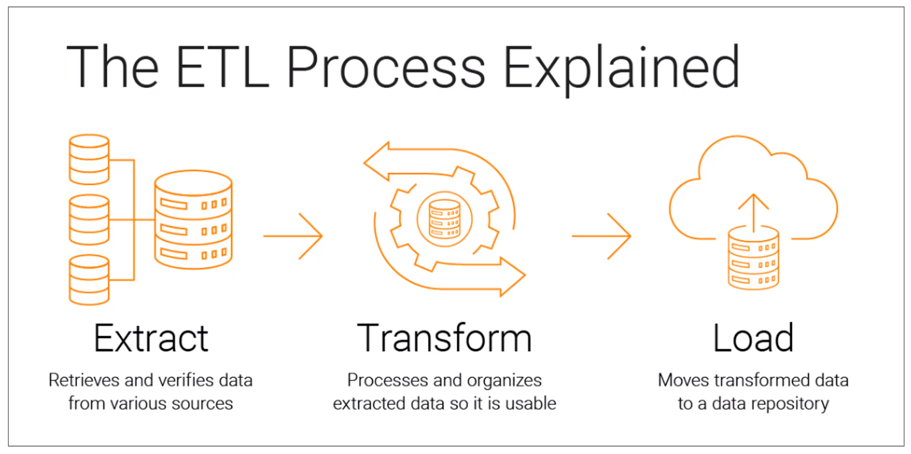
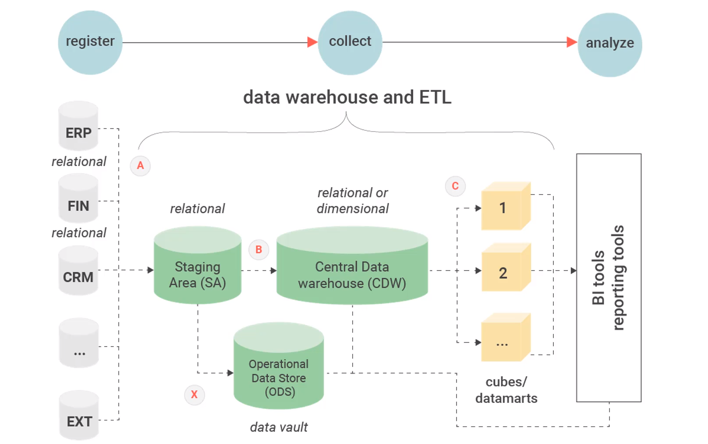
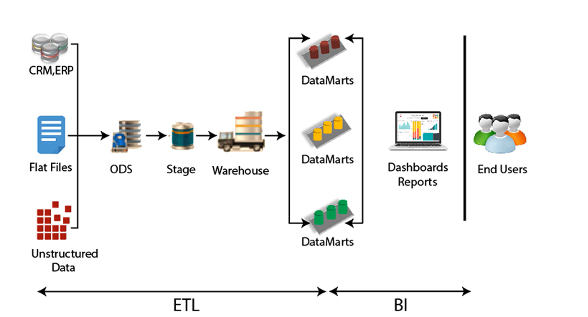
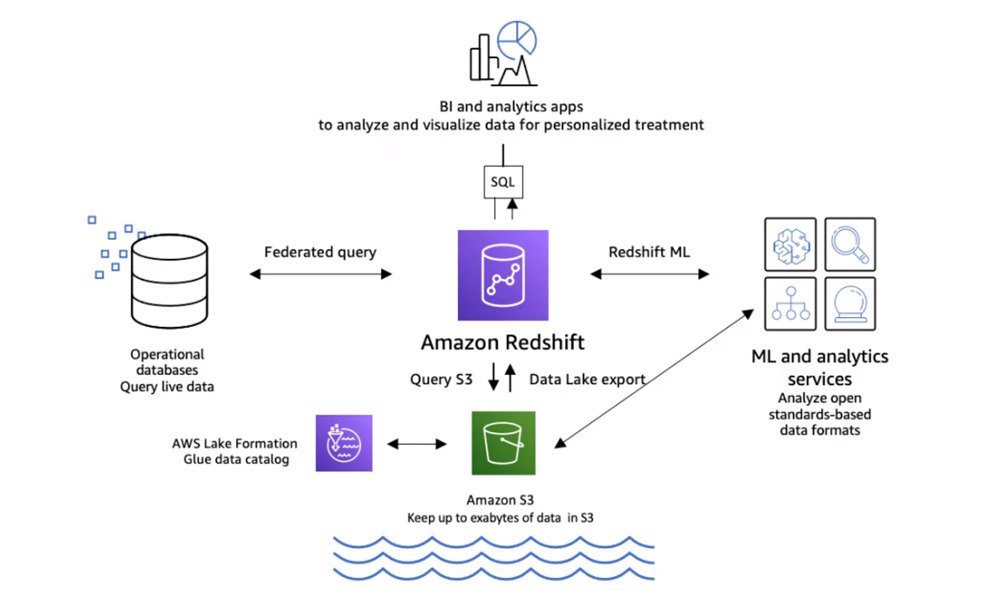
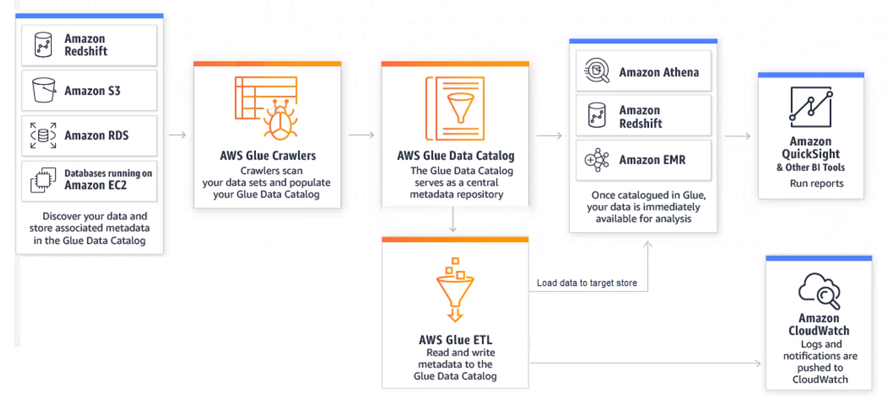

# Processus ETL

ETL (Extract, Transform and Load) est un processus permettant d'extraire des données de sources variées, de les transformer selon les besoins, puis de les charger dans un référentiel de données. Cette étape est cruciale pour garantir la qualité et la cohérence des données avant de les intégrer dans un système de stockage ou d'analyse. Le processus ETL implique généralement plusieurs étapes, notamment l'extraction des données à partir de différentes sources telles que des bases de données, des fichiers plats ou des API, la transformation des données pour les adapter aux besoins de l'application, et enfin le chargement des données transformées dans un entrepôt de données ou une base de données.

## 1. Extraction (*Extract*)

L'étape d'extraction (ou **Extract**) du processus ETL consiste à récupérer les données à partir de différentes sources, telles que des bases de données, des fichiers plats, des services web, ou des flux de données en temps réel.

**Exemples avec des services AWS** :
- Récupération de données depuis **Amazon S3** : Extraction de fichiers CSV, JSON ou Parquet stockés dans des buckets S3 à l'aide de requêtes S3 API.
- Extraction de données depuis **Amazon RDS** : Récupération de données depuis une base de données relationnelle comme MySQL, PostgreSQL ou Oracle hébergée sur Amazon RDS en utilisant des requêtes SQL.

## 2. Transformation

L'étape de transformation du processus ETL implique le nettoyage, la manipulation et la structuration des données extraites afin de les rendre utilisables et cohérentes pour l'analyse ou le chargement ultérieur (ça peut être basique ou très complexe).

**Exemples avec des services AWS** :
- Nettoyage des données avec **AWS Glue** : Utilisation des jobs AWS Glue pour nettoyer et transformer les données extraites en supprimant les valeurs manquantes, les doublons, ou en effectuant des opérations de formatage.
- Transformation des données avec **AWS Lambda** : Utilisation de fonctions AWS Lambda pour effectuer des transformations personnalisées sur les données extraites, telles que la conversion de formats ou l'enrichissement des données.

## 3. Chargement (*Load*)

L'étape de chargement (ou **Load**) du processus ETL consiste à charger les données transformées dans un entrepôt de données ou une base de données destinataire.

**Exemples avec des services AWS** :
- Chargement des données dans **Amazon Redshift** : Écriture des données transformées dans un entrepôt de données Amazon Redshift pour l'analyse ultérieure à l'aide de requêtes SQL.
- Chargement des données dans **Amazon DynamoDB** : Insertion des données transformées dans une base de données NoSQL comme Amazon DynamoDB pour un accès rapide et évolutif aux données.

## Services Amazon pour ETL

AWS propose deux services principaux pour les processus ETL :

- **AWS Glue** : AWS Glue est un service entièrement géré qui offre une solution serverless pour l'extraction, la transformation et le chargement (ETL) des données. Il permet de découvrir, cataloguer et transformer les données rapidement et efficacement. Glue prend en charge divers types de données, y compris les données structurées et semi-structurées, et offre une intégration facile avec d'autres services AWS. Bien que Glue soit facile à utiliser et évolutif, il peut être relativement coûteux pour de gros volumes de données.

- **Amazon EMR** : Amazon EMR (Elastic MapReduce) est un service de traitement de données entièrement géré qui permet de provisionner facilement des clusters Hadoop, Spark, HBase et Presto. Bien que EMR soit principalement utilisé pour le traitement de données massives et l'analyse en temps réel, il peut également être utilisé pour les tâches ETL. EMR offre une grande flexibilité en termes de configuration et de gestion des clusters, ainsi qu'une intégration étroite avec d'autres services AWS. Il est souvent préféré pour les scénarios nécessitant un contrôle plus granulaire sur l'infrastructure sous-jacente.